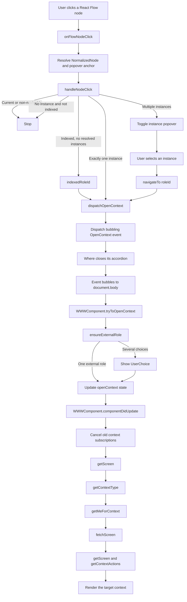

# Technical reference: navigation graph control flow

This document describes the flow of control when a user initiates navigation
by clicking a context node in the model-static navigation graph. It follows the
interaction from React Flow, through the `OpenContext` DOM event, to loading and
rendering the target context screen.

---

## 1. Overview



The graph does not navigate directly through React props or a router. It emits
an application-level `OpenContext` custom DOM event. The root
`WWWComponent` consumes that event and changes its `openContext` state.

---

## 2. React Flow receives the click

`NavigationGraphView` supplies `onFlowNodeClick` as the `onNodeClick` callback
of `ReactFlow` in `src/NavigationGraphView.tsx`.

When React Flow invokes the callback, `onFlowNodeClick`:

1. Reads the `NormalizedNode` from `rfNode.data.node`.
2. Stops if the React Flow node has no normalized node data.
3. Computes the clicked node's position relative to the graph canvas.
4. Passes the normalized node and popover anchor to `handleNodeClick`.

The anchor is only used when the node represents multiple context instances.
It allows the instance chooser to be positioned next to the clicked node.

---

## 3. The normalized node determines the branch

`handleNodeClick` in `src/NavigationGraphView.tsx` applies the following rules
in order.

### 3.1 Current or non-navigable node

If the node represents the current context, or `node.isNavigable` is false,
the callback returns without doing anything.

The normalizer in `src/graphNormalization.ts` marks a node as navigable when:

- it is not the current node; and
- it has at least one resolved instance or an indexed context instance ID.

### 3.2 Multiple resolved instances

If `node.instances.length > 1`, clicking the node toggles an instance-selection
popover. Multiple instances take precedence over the indexed shortcut.

No navigation event is dispatched at this point. Navigation continues only
when the user clicks a `ListGroup.Item` in the popover. That item calls
`navigateTo(inst.roleId)`, which closes the popover and calls
`dispatchOpenContext` with the selected role instance ID.

### 3.3 Indexed node without resolved instances

For an indexed node with no resolved instances, `indexedRoleId(node)` converts
the indexed context instance ID into its external role instance ID. The result
is passed directly to `dispatchOpenContext`.

### 3.4 Exactly one resolved instance

If there is exactly one resolved instance, its `roleId` is passed directly to
`dispatchOpenContext`.

### 3.5 No navigation target

If there are no resolved instances and no indexed role ID, the callback
returns without dispatching an event. In normal operation this agrees with the
node's `isNavigable` value and cursor styling.

---

## 4. Dispatching `OpenContext`

`dispatchOpenContext` creates this event:

```typescript
new CustomEvent("OpenContext", {
  detail: roleId,
  bubbles: true,
});
```

It dispatches the event on `hostRef.current`, which is the root element of the
`Where` component. If that ref is unavailable, it falls back to
`document.body`.

The role instance ID is carried directly in `event.detail`. Because the event
bubbles, components between the graph and the application root may perform
local cleanup without owning the navigation itself.

---

## 5. Local handling in `Where`

In `src/where.tsx`, `Where.componentDidMount` registers an `OpenContext`
listener on the same root element supplied to `NavigationGraphView` as
`hostRef`.

That listener only clears `accordionOpen`. It does not call
`stopPropagation`, so the event continues to bubble to `document.body`.

This separates two responsibilities:

- `Where` closes local navigation UI.
- `WWWComponent` changes the application-level open context.

---

## 6. Application-level handling in `WWWComponent`

In `src/www.tsx`, `WWWComponent.componentDidMount` registers an `OpenContext`
listener on `document.body`. The listener:

1. Calls `stopPropagation()`.
2. Passes `event.detail` to `tryToOpenContext`.

`tryToOpenContext` calls `ensureExternalRole` because an incoming identifier
may need to be normalized to an external role instance.

### 6.1 One external role

When `ensureExternalRole` returns `RoleInstance` and the role differs from the
currently open context, `tryToOpenContext` starts two paths:

- It asynchronously requests the role name, then updates `document.title` and
  pushes a browser history entry.
- It immediately updates component state with the new `openContext`, closes the
  left panel, and selects the `what` section.

Selecting `what` means that navigation initiated from the Where tab on mobile
moves the user to the target context's What tab.

If the resolved external role is already open, no state change or screen reload
is performed.

### 6.2 Several possible external roles

When `ensureExternalRole` returns `Choices`, `tryToOpenContext` stores a
`choiceMessage` in state. `UserChoice` presents those alternatives. Selecting
one updates `openContext` and selects the `what` section.

### 6.3 Resolution failure

Errors from `ensureExternalRole` are sent to `UserMessagingPromise`, which
presents an end-user error message.

---

## 7. Loading the target context screen

Changing `WWWComponent.state.openContext` causes
`WWWComponent.componentDidUpdate` to run. It:

1. Unsubscribes the previous `getMeForContext` subscription, when present.
2. Unsubscribes the previous screen subscription, when present.
3. Waits for those unsubscribe requests to finish.
4. Calls `getScreen` with the new external role ID.

`getScreen` then:

1. Derives the context instance ID from the external role ID.
2. Calls `PDRproxy.getContextType` for that context.
3. Calls `PDRproxy.getMeForContext` to determine the user's role types.
4. Calls `fetchScreen` with the first available user role type.

`fetchScreen` subscribes to the screen with `PDRproxy.getScreen`, fetches the
available context actions, and updates:

- `screen`;
- `openContextType`;
- `openContextUserType`;
- `actions`; and
- `title`.

Those state changes render the target context in the Who, What, and Where
views.

---

## 8. Rebuilding the navigation graph

The new `openContext` and `openContextType` flow back into `Where` as props.
`Where.componentDidUpdate` refreshes each data source only for the prop that
controls it:

- A changed `currentContextType` fetches the model-static graph.
- A changed `openContext` restarts the wider-context subscription.

The previous graph and wider-context data remain rendered while their
replacements are fetched. The wider-context subscription includes each
context type, so its complete result is published directly with one state
update. Identical continuous subscription results do not produce another
update.

Separate generation counters prevent late graph results, wider-context
callbacks belonging to the previous context from being accepted into state.
Wider-context unsubscription and resubscription remain serialized so that a
late subscription registration is cleaned up by the next restart.

As the new graph and wider-context data arrive, `NavigationGraphView`
normalizes them and renders the graph around the newly opened context. Its
local full-graph and popover state is also reset when `currentContextType` or
`modelGraph` changes.

---

## 9. Primary implementation locations

| Responsibility | Location |
|---|---|
| React Flow click entry point | `src/NavigationGraphView.tsx`, `onFlowNodeClick` |
| Node branching rules | `src/NavigationGraphView.tsx`, `handleNodeClick` |
| Instance chooser navigation | `src/NavigationGraphView.tsx`, `navigateTo` |
| `OpenContext` event creation | `src/NavigationGraphView.tsx`, `dispatchOpenContext` |
| Navigability and indexed-role conversion | `src/graphNormalization.ts` |
| Local accordion cleanup | `src/where.tsx`, `componentDidMount` |
| Application-level event listener | `src/www.tsx`, `componentDidMount` |
| External-role resolution | `src/www.tsx`, `tryToOpenContext` |
| Context-change lifecycle | `src/www.tsx`, `componentDidUpdate` |
| PDR screen loading | `src/www.tsx`, `getScreen` and `fetchScreen` |
| Graph refresh | `src/where.tsx`, `refreshModelGraph` |
| Wider-context subscription restart | `src/where.tsx`, `restartWiderContextsSubscription` |
